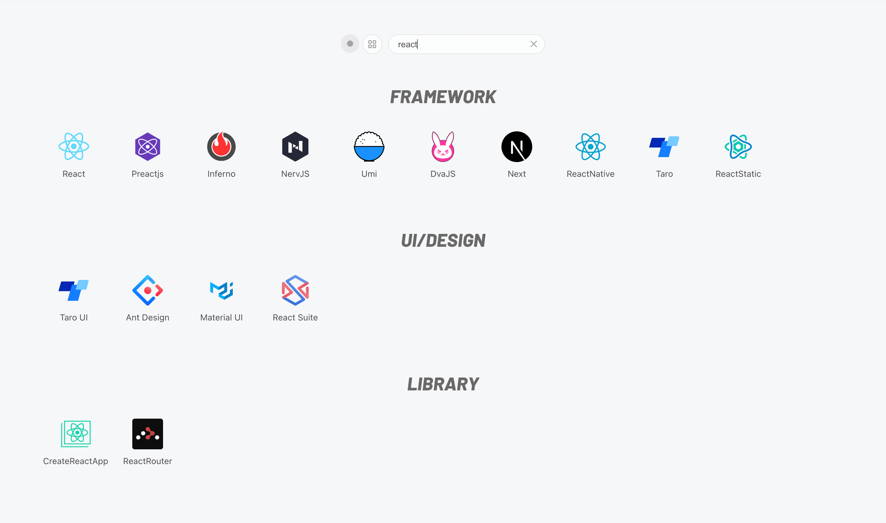

## A navigation for developer

[https://hello-nav.github.io](https://hello-nav.github.io)

## 🗺 Features

- 160+ Apps
- App search with keywords
- List or category view
- Github link
- Offline
- Dark mode

## 🎨 Design





## 👩🏻‍💻 Develop & Build

```bash
# Clone project
git clone https://github.com/hello-nav/hello-nav.git

# Change directory to project directory
cd hello-nav

# Installation dependencies
npm install

# Develop project
npm run start
```

```bash
# Build project
npm run build
```

## 🎯 Todo

- [x] app search
- [x] list & category mode
- [x] github link
- [x] offline
- [x] dark mode
- [ ] favorites apps
- [ ] sync setting
- [ ] mobile UI

## 📄 License

Hello Nav is [MIT](https://github.com/hello-nav/hello-nav/blob/master/LICENSE) license.

© 2018-present Bener
